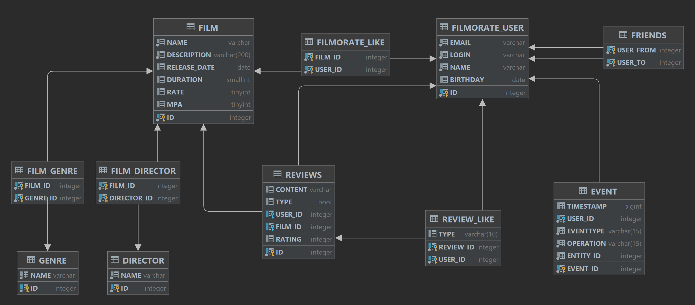

# Это репозиторий учебного проекта "Filmorate"

**Данный проект реализован на базе SpringBoot в рамках командной разработки бэкенд для REST-сервиса, в котором
пользователи
могут оценивать фильмы, оставлять отзывы, добавлять друг друга в друзья, получать рекомендации к просмотру и т. д.**

# Функциональность приложения:

1. Стандартные CRUD для фильмов, пользователей, отзывов

> API: /reviews /users /films

2. Добавление и удаление из друзей, вывод списка общих друзей
3. Добавление лайка фильму и отзыву, удаление лайка

> PUT {id}/like/{userId}

4. Поиск фильмов по названию и по режиссеру

> GET /fimls/search

5. Вывод общих с другом фильмов, отсортированных по популярности

> GET /films/common?userId={userId}&friendId={friendId}

6. Получение рекомендаций по просмотру с применением алгоритма Slope One

> GET /users/{id}/recommendations

7. Получение ленты событий:

> GET /users/{id}/feed

8. Вывод самых популярных фильмов по жанру и годам

> GET /films/popular?count={limit}&genreId={genreId}&year={year}

В рамках командной работы я занимался разработкой следующих фичей:

1. Лента событий
2. Reviews

_Также проводил code-review по всем Pull Requests проекта_

# Стек технологий

* Spring Boot 2.7
* Система сборки : Maven
* СУБД : H2

### ER diagram

